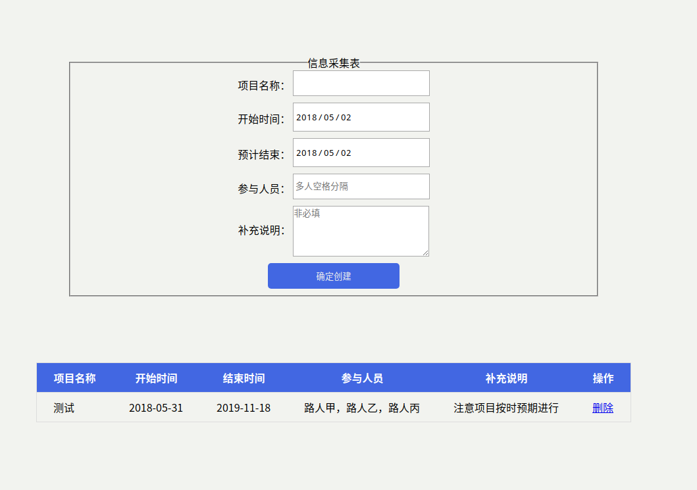
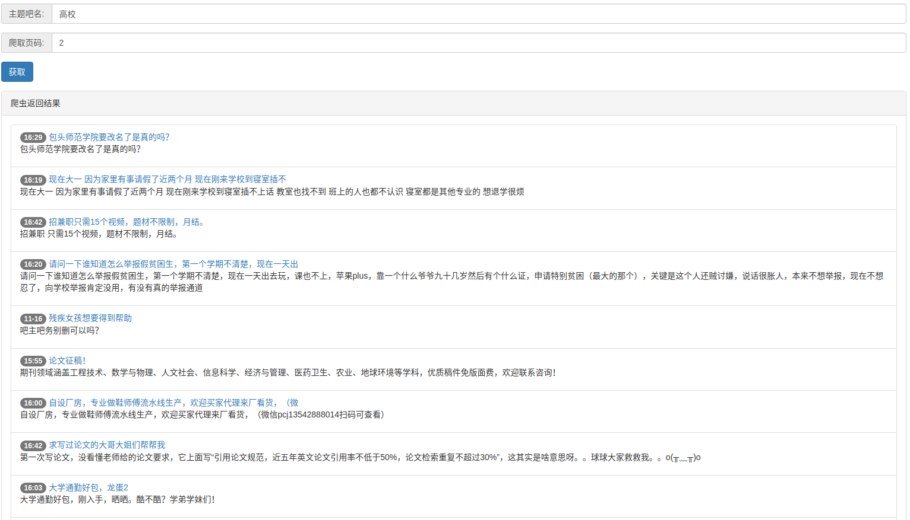

>由本人业余时间完成，供学习参考使用

☆实验室一：JS 模拟简易版贪吃蛇，无依赖.

- Github地址：[RetroSnake](https://github.com/okaychen/RetroSnake)

- 在线测试：[RetroSnake](http://www.chenqaq.com/lab/RetroSnake/index.html)

- 效果展示：
<fancybox></fancybox>

实验室二：IndexedDB 增删改查.

- Github地址：无

- 在线测试：[IndexedDB 简单增删改查](http://www.chenqaq.com/lab/IndexedDB/index.html)

- 效果展示：
<fancybox></fancybox>

实验室三：饿了吗demo.

- Github地址：[elm-demo](https://github.com/okaychen/elm)

- 在线测试：

- 效果展示：
<fancybox style="justify-content: left;">

</fancybox>

实验室四：一个图片预加载的小插件

- Github地址：[preload](https://github.com/okaychen/preload)

- 在线测试：

- 效果展示：

实验室五：贴吧NODE爬虫实践.

- Github地址：[node-reptile](https://github.com/okaychen/NetworkMonitoring)

- 在线测试：

- 效果展示：
<fancybox></fancybox>